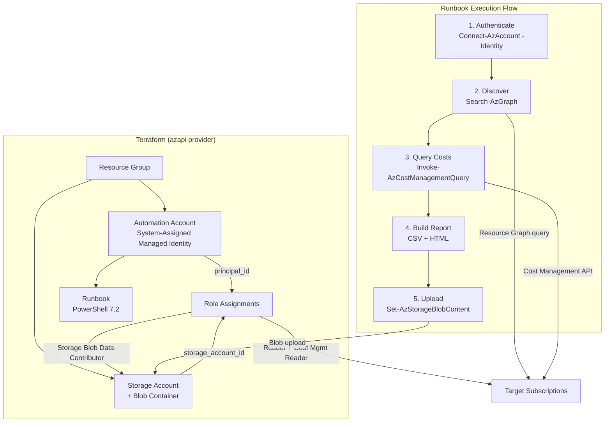

# Architecture

## Overview

Model Hunter is deployed entirely through Terraform (using the `azapi` provider — no `azurerm`) and runs as a PowerShell 7.2 Runbook inside Azure Automation. The infrastructure provisions the compute, storage, identity, and permissions needed for the Runbook to scan subscriptions and publish reports.

## System Diagram

## Infrastructure Components

All infrastructure is defined in `infra/` and organized as one module per resource type under `infra/modules/`. The root `infra/main.tf` orchestrates the modules.

| Module | Resource | Description |
|---|---|---|
| `resource-group` | Resource Group | Contains all Model Hunter resources. |
| `automation-account` | Automation Account | Hosts the Runbook with a System-Assigned Managed Identity for authentication. |
| `storage-account` | Storage Account + Blob Container | Stores generated CSV and HTML reports in the `model-discovery-reports` container. |
| `runbook` | Automation Runbook | PowerShell 7.2 Runbook sourced from `src/main.ps1`. Runs on a schedule. |
| `role-assignments` | Role Assignments | Grants the Managed Identity Reader, Cost Management Reader, and Storage Blob Data Contributor roles. |

## Runbook Pipeline

The Runbook (`src/main.ps1`) executes a 5-step pipeline each time it runs:

1. **Authenticate** — Connects to Azure using the Managed Identity (`Connect-AzAccount -Identity`).
2. **Discover** — Queries Azure Resource Graph (`Search-AzGraph`) for all `microsoft.cognitiveservices/accounts` and their deployments across target subscriptions.
3. **Query Costs** — Retrieves the last 3 billing periods (`Get-AzBillingPeriod`) and queries Cost Management (`Invoke-AzCostManagementQuery`) filtered to Azure AI Foundry Models and Azure OpenAI Service.
4. **Build Report** — Merges deployment data with cost data and generates both CSV and HTML outputs. The HTML report uses conditional row formatting (green for in-use, red for unused).
5. **Upload** — Publishes timestamped CSV and HTML files to the configured blob container via `Set-AzStorageBlobContent`.

## Authentication Model

The Automation Account uses a **System-Assigned Managed Identity**. The Terraform `role-assignments` module grants this identity three roles:

| Role | Scope | Used By |
|---|---|---|
| Reader | Each target subscription | `Search-AzGraph` — resource discovery |
| Cost Management Reader | Each target subscription | `Invoke-AzCostManagementQuery` — cost queries |
| Storage Blob Data Contributor | Storage account | `Set-AzStorageBlobContent` — report upload |

No secrets, keys, or connection strings are stored. The Managed Identity authenticates automatically within the Automation runtime.

## Provider Notes

- **azapi only** — the project uses the `azapi` Terraform provider exclusively. The `azurerm` provider is not used.
- **Stable API versions** — every `azapi_resource` specifies an explicit, stable API version (e.g., `@2023-11-01`). Preview API versions are avoided unless a feature is only available in preview.
